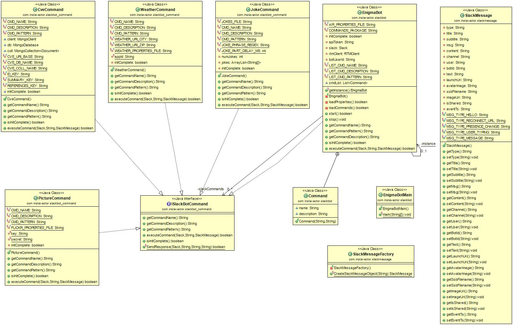

# EnigmaBot
Java-based Slack Bot that responds to a few simple commands

## Requirements
1. Integrate with Slack
1. Provide a list of commands
1. Retrieve answers to at least four commands
1. Have a name and avatar
1. Provide a README file for the project
1. Implement unit tests
1. Integrate tests of service layer
1. Integrate Travis CI to build and test the project

## Design
A UML class diagram of the EnigmaBot source code is shown below:

(Class diagram generated from source using the [OjbectAid Eclipse Plugin](http://www.objectaid.com/).)

The classes represented in the diagram above:
 * [EnigmaBotMain](https://github.com/yelkeew/EnigmaBot/blob/master/src/com/instavector/slackbot/EnigmaBotMain.java) is the application entry point, handling bot startup & shutdown.
 * [EnigmaBot](https://github.com/yelkeew/EnigmaBot/blob/master/src/com/instavector/slackbot/EnigmaBot.java) uses the [jSlack](https://github.com/seratch/jslack) library for Slack integration.  This class listens for Slack messages (direct or on a channel to which the bot has been invited), parses the message content, and executes commands found in the messages.
 * [SlackMessage](https://github.com/yelkeew/EnigmaBot/blob/master/src/com/instavector/slackmessage/SlackMessage.java) Java bean class used to deserialize received slack messages from JSON.  Deserialization uses the [Google GSON library](https://github.com/google/gson).
 * [SlackMessageFactory](https://github.com/yelkeew/EnigmaBot/blob/master/src/com/instavector/slackmessage/SlackMessageFactory.java) Used for SlackMessage object.
 * [ISlackBotCommand](https://github.com/yelkeew/EnigmaBot/blob/master/src/com/instavector/slackbot_command/ISlackBotCommand.java) is the interface implemented by all supported commands.  The main EnigmaBot class uses the [Reflections](https://github.com/ronmamo/reflections) library to locate commands within the "com.instavector.slackbot_command" package at runtime.
 * [CveCommand](https://github.com/yelkeew/EnigmaBot/blob/master/src/com/instavector/slackbot_command/CveCommand.java) searches a database of CVE records for CVE identifier or keyword (returns up to 10 matching results).
 * [JokeCommand](https://github.com/yelkeew/EnigmaBot/blob/master/src/com/instavector/slackbot_command/JokeCommand.java) tells you a random joke from the [jokes.txt](https://github.com/yelkeew/EnigmaBot/blob/master/jokes.txt) file.
 * [PictureCommand](https://github.com/yelkeew/EnigmaBot/blob/master/src/com/instavector/slackbot_command/PictureCommand.java) retrieves a random picture from Flickr having the specified tag
 * [WeatherCommand](https://github.com/yelkeew/EnigmaBot/blob/master/src/com/instavector/slackbot_command/WeatherCommand.java) provides a weather forecast for a zip code or city name

## Build
EnigmaBot uses Maven.  Run `mvn package` to build the project.   

## Test
 1. Populate "*-token" properties files in the project directory
    * .api-token: [Slack API token](https://api.slack.com/bot-users), `apiToken = xxxxxxxxxx`
    * .weather-token: [Open Weather Map token](http://openweathermap.org/appid), `appId = xxxxxxxxxx`
    * .flickr-token: [Flickr API token](https://www.flickr.com/services/api/misc.api_keys.html), `key = xxxxxxxxxx, secret = xxxxxxxxxx`
 1. Populate the local CVE database by installing and intializing the [CVE Search](https://github.com/cve-search/cve-search) application
 1. Ensure Mongo is running on the same system as the bot to support CVE lookups
 1. Add a bot to your Slack channel
 1. Upload the `robot.jpg` file as the bot's avatar
 1. Run the bot: `java -cp "target\deps\*;target\enigmabot-0.0.1.jar" com.instavector.slackbot.EnigmaBotMain`
 1. Create Slack channel for testing, e.g., "bot-testing" or direct-message the bot
 1. Invite bot to channel, `/invite @enigma-bot`
 1. Send a `list` message to see a list of commands supported by the bot

## TODO
1. Add environment variable support for base directory in which to look for property files
1. Better regular expression handling for command arguments
1. JavaDoc comments
1. CVE command property file to allow non-default parameters for Mongo DB connection
